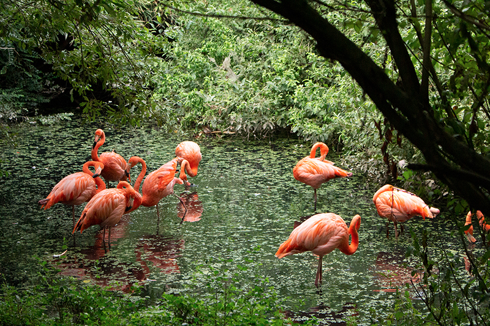

# PseudoGray

This algorithm can generate a pseudo-grayscale with a depth of 11.77 bits, approximately 3481 perceived shades of pseudo-gray compared to the 256 real shades of a normal grayscale image.

Pseudo-gray images allow us to see monochrome images from sources with greater bit depth, such as X-ray images, on an RGB screen with 8-bit channels.

Original (scaled) flamingos image:

