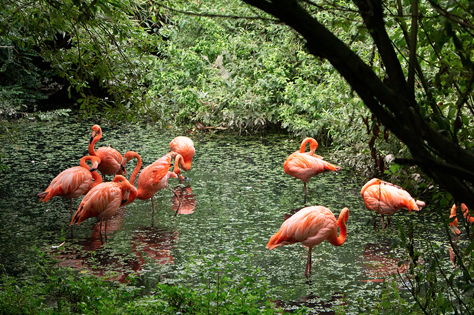

# PseudoGray

PseudoGray is a small C++Builder VCL image viewer that demonstrates a
pseudo-grayscale rendering technique for 16-bit monochrome images.

A normal 8-bit grayscale image can display only 256 gray levels on a standard
RGB monitor. Pseudo-gray rendering uses carefully chosen, near-neutral RGB
triplets to produce about 3,481 visually distinct gray-like levels, or roughly
11.77 bits of perceived depth. This makes it easier to inspect high bit-depth
monochrome sources, such as X-ray or scientific images, on ordinary 8-bit RGB
displays.


Original scaled sample image:



## Features

- Opens 16-bit grayscale TIFF images through Windows Imaging Component (WIC).
- Shows the original image, pseudo-gray rendering, and conventional 8-bit
  grayscale rendering in synchronized tabs.
- Keeps the three views aligned while scrolling.
- Displays RGB values under the mouse pointer for the generated bitmap views.
- Uses a 32-bit BGRA output format for the generated images.

## Building

The project is an Embarcadero C++Builder VCL application.

Current project settings target the modern Windows 64-bit toolchain:

- Platform: `Win64x`
- Compiler: `bcc64x` / Clang-based C++Builder toolchain
- Language mode: ISO C++23
- Instruction set: AVX2

The AVX2 setting allows the compiler to emit AVX2 instructions for optimized
Release builds. The resulting executable should be run on CPUs that support
AVX2.

## How It Works

The main workflow lives in `TfrmMain::LoadImage` in `FormMain.cpp`.

1. A file is loaded into a `TWICImage`.
2. The WIC bitmap is locked for read access.
3. The image is accepted only if its pixel format is
   `GUID_WICPixelFormat16bppGray`.
4. Two VCL bitmaps are allocated:
   - a pseudo-gray bitmap
   - a conventional grayscale bitmap
5. The 16-bit source pixels are converted row by row into 32-bit BGRA pixels.
6. The generated bitmaps are assigned to the VCL image controls.

For each source pixel, the high 8 bits provide the base grayscale value. The
next lower 4 bits select a small RGB offset from lookup tables:

```text
gray8 = gray16 >> 8
index = (gray16 >> 4) & 0x0F

B = clamp(gray8 + offsetB[index], 0, 255)
G = clamp(gray8 + offsetG[index], 0, 255)
R = clamp(gray8 + offsetR[index], 0, 255)
```

The offsets are intentionally tiny, usually `-1`, `0`, or `1`, so the generated
colors remain visually close to neutral gray while still increasing the number
of distinguishable output levels.

## Implementation Notes

The conversion code uses `pf32bit` VCL bitmaps and writes `RGBQUAD` pixels. This
is slightly larger than the previous 24-bit representation, but it gives each
pixel a regular 4-byte BGRA layout. That layout is friendlier to the CPU cache,
to compiler vectorization, and to future explicit SIMD implementations.

The former per-pixel `switch` statement has been replaced by three constexpr
lookup tables, one for each RGB channel. This keeps the conversion branch-free
inside the inner pixel loop and gives `bcc64x` a simpler loop to optimize.

The conversion is parallelized by row ranges with `std::async`. Each task writes
to a distinct set of destination rows, so no locking is needed during pixel
conversion. The main thread also processes the first row range while the
background tasks handle the remaining chunks.

The project currently enables AVX2 in the C++Builder project file. This does not
mean the source code contains hand-written AVX2 intrinsics; instead, it allows
the Clang-based compiler to use AVX2 where its optimizer can prove that doing so
is valid and beneficial. The table-driven 32-bit conversion path was chosen to
make that optimization opportunity more realistic while keeping the code
portable and maintainable.

## Project Structure

- `PseudoGray.cpp`: application entry point and VCL style setup.
- `FormMain.cpp`: image loading, conversion, rendering, and UI behavior.
- `FormMain.h`: main form declaration and the custom scrollbox class used to
  synchronize scrolling between tabs.
- `FormMain.dfm`: VCL form layout.
- `Images/PinkFlamingos16.tif`: sample 16-bit grayscale input image.
- `docs/assets/images`: images used by this README.
